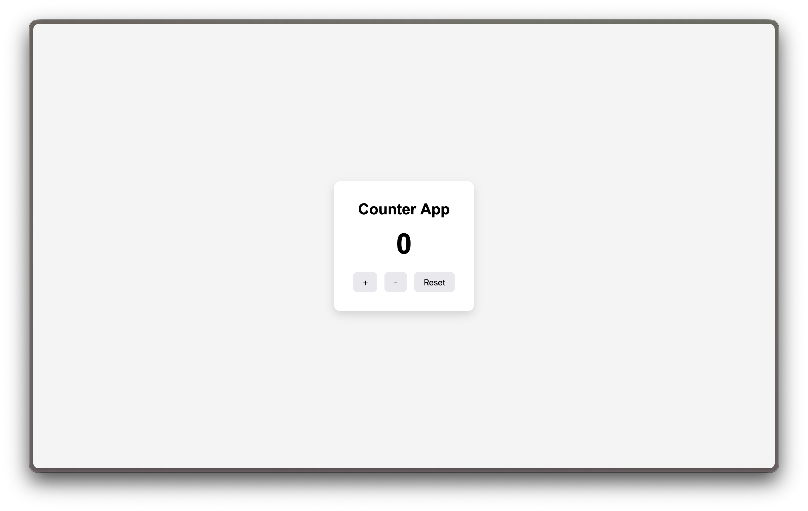

# Counter App
A simple React application demonstrating state management using the `useState` hook.

## Screenshot


## Features
- Increment count
- Decrement count
- Reset count

## Concepts Used
- React Components
- useState Hook
- Event Handling
- Conditional Rendering

## Run
```bash
npm install
npm run dev
```
