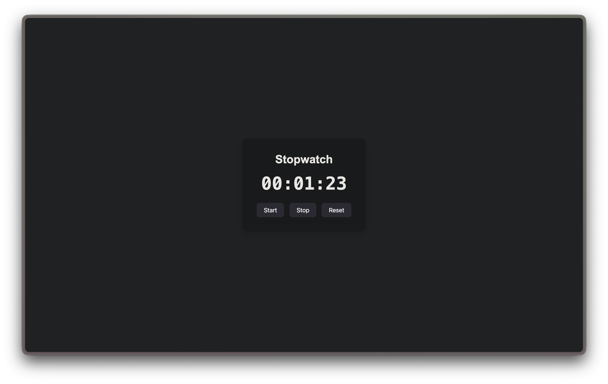

# Stopwatch App

A simple React stopwatch application built using React Hooks.

## Screenshot

```markdown

```

---

## Features

- Start the stopwatch
- Stop/Pause the stopwatch
- Reset the stopwatch
- Displays time in **MM:SS:MS** format

---

## Concepts Used

- React Components
- useState Hook
- useEffect Hook
- setInterval
- Cleanup Function
- Event Handling

---

## Installation

```bash
npm install
npm run dev
```

---

## Tech Stack

- React
- Vite
- JavaScript
- CSS