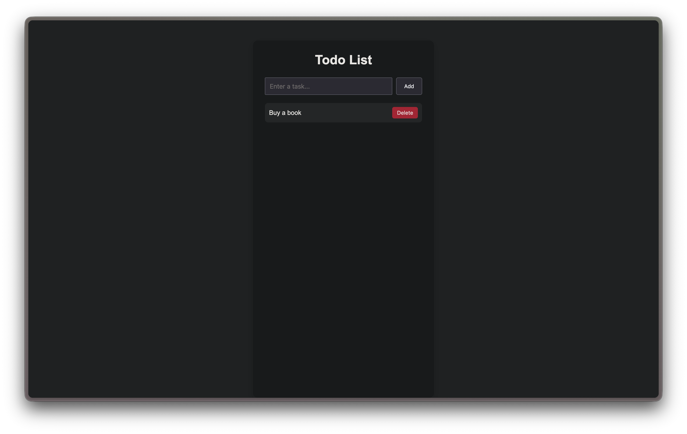

# Todo List App
A simple Todo List application built with React that allows users to add, complete, and delete tasks.

## Screenshot


---

## Features
- Add new tasks
- Delete tasks
- Mark tasks as completed
- Responsive and clean UI

---

## Concepts Used

- React Components
- useState Hook
- Rendering Lists
- Event Handling
- Controlled Components
- Conditional Styling

---

## Installation

```bash
npm install
npm run dev
```

---

## Tech Stack

- React
- Vite
- JavaScript
- CSS